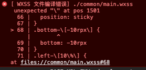
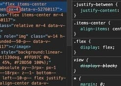

- [本文掘金链接](https://juejin.cn/post/7257022428193636409)

> 如题，是基于HbuilderX创建的小程序项目，非cli方式创建的项目

## 1.啰嗦两句

+ [tailwindcss](https://www.tailwindcss.cn)已经出来很长时间了，在前端娱乐圈里也是炒的火热。这个工具还没使用过，[windicss](https://windicss.org/guide/)这个新的轮子又都扎我脸上了。
+ 之前被uniapp HbuilderX方式创建的h5项目折腾过，这篇文章[《uniapp 打包 h5 问题总结》](https://juejin.cn/post/7129492032241795080)有记录。那这次为什么还要用HbuilderX这种方式，没办法，一开始项目不是我创建的。

省流（得出结论）：
+ uniapp HbuilderX方式被高度封装，都被封装到他的应用里去了，虽暴露出来的几个文件和方法，后续配置起来还是费劲。
+ 而用vue-cli方式创建的，配置文件全部暴露，方便后续修改

## 2.开始配置

> + 根据这位兄弟的分享，[Hbuilder创建的uniapp工程，使用tailwindcss最优雅的方式](https://ask.dcloud.net.cn/article/40098) 提示，HbuilderX创建的uniapp工程也是内置了postcss，但都是高度封装的。
> + 想基于它内部的postcss中添加`tailwindcss plugins`，很难，路会走偏(亲测，路确实很偏，一堆报错，还会和uview-ui冲突)
> + 所以这里直接使用`Tailwind CLI`方式

根据[文档](https://www.tailwindcss.cn/docs/installation)

1. `npm install -D tailwindcss`安装

2. `npx tailwindcss init`，生成`tailwind.config.js` 配置文件

```javascript
/** @type {import('tailwindcss').Config} */
module.exports = {
	// https://ask.dcloud.net.cn/article/40098
  	separator: '__', // 如果是小程序项目需要设置这一项，将 : 选择器替换成 __，之后 hover:bg-red-500 将改为 hover__bg-red-500  
  	corePlugins: {  
  		// 预设样式  
  		preflight: false, // 一般uniapp都有预设样式，所以不需要tailwindcss的预设  
  		// 以下功能小程序不支持  
  		space: false, // > 子节点选择器  
  		divideWidth: false,  
  		divideColor: false,  
  		divideStyle: false,  
  		divideOpacity: false,  
  	},
	  content: [
		  './pages/**/*.{vue,js}',
		  // './main.js',  
		  './App.vue',  
		  // './index.html' 
	  ],
	  theme: {
		extend: {},
	  },
	  plugins: [],
}
```
3. 根目录新建`tailwind-input.css`

```css
/* @tailwind base; */
@tailwind components;
@tailwind utilities;
```

4. 开启 Tailwind CLI 构建流程

```sh
npx tailwindcss -i ./tailwind-input.css -o ./static/css/tailwind.css --watch
```

5. `App.vue`中引入编译过的`tailwind.css`

```diff
<style lang="scss">
	@import "@/uni_modules/uview-ui/index.scss";
+	@import url("./static/css/tailwind.css");
</style>
```

其实到这里已经ok了，缺点就是每次运行项目都要自己手动去执行`npx tailwindcss -i ./tailwind-input.css -o ./static/css/tailwind.css --watch`,不方便
所以必须改成自动化

## 3.启动项目自动化tailwindcss编译

> 庆幸的是，uniapp官方暴露出来了`vue.config.js`，我们可以在这里面配置

### 3.1 `package.json`中添加自定义脚本运行

```json
{
	"scripts": {
		"tailwind:dev": "npx tailwindcss -i ./tailwind-input.css -o ./static/css/tailwind.css --watch",
		"tailwind:prod": "npx tailwindcss -i ./tailwind-input.css -o ./static/css/tailwind.css"
	},
	"uni-app": {
		"scripts": {
			"dev:mp-weixin:dev": {
				"title": "本地开发-测试环境接口",
				"browser": "",
				"env": {
					"UNI_PLATFORM": "mp-weixin",
					"NODE_ENV": "development",
					"BASE_URL_ENV": "development"
				},
				"define": {
					"CUSTOM-CONST": true
				}
			},
			"dev:mp-weixin:prod": {
				"title": "本地开发-正式环境接口",
				"browser": "",
				"env": {
					"UNI_PLATFORM": "mp-weixin",
					"NODE_ENV": "development",
					"BASE_URL_ENV": "production"
				},
				"define": {
					"CUSTOM-CONST": true
				}
			},
			"build:mp-weixin:dev": {
				"title": "打包-测试环境接口",
				"browser": "",
				"env": {
					"UNI_PLATFORM": "mp-weixin",
					"NODE_ENV": "production",
					"BASE_URL_ENV": "development"
				},
				"define": {
					"CUSTOM-CONST": true
				}
			},
			"build:mp-weixin:prod": {
				"title": "打包-正式环境接口",
				"browser": "",
				"env": {
					"UNI_PLATFORM": "mp-weixin",
					"NODE_ENV": "production",
					"BASE_URL_ENV": "production"
				},
				"define": {
					"CUSTOM-CONST": true
				}
			}
		}
	}
}
```

### 3.2 根目录新建`vue.config.js`

> + 利用`child_process.exec`执行子进程，运行`npx tailwindcss -i ./tailwind-input.css -o ./static/css/tailwind.css --watch`,
> + 问题也就出现在这，child_process.exec默认用的是`/bin/sh`执行，虽然可以配置修改成`{shell: '/bin/bash'}`或者`{shell: '/bin/zsh'}`,
> + 但是tailwindcss每次都报错，因为HbuilderX执行vue.config.js里采用的nodejs版本是`v12`，通过`console.log(process.version)`可以看到nodejs当前版本
> + 为什么它这里采用的是nodejs v12版本，暂不清楚，但本地zsh，执行`node -v`，是v16版本
> + nodejs v12版本执行tailwindcss编译，[Npx tailwindcss results in "Unexpected Token ."](https://github.com/tailwindlabs/tailwindcss/discussions/8807)
> + 根据提示，解决办法就是切换当前nodejs版本为v16


```javascript
const {exec} = require('child_process');

console.log("process.env.UNI_SCRIPT:", process.env.UNI_SCRIPT);
console.log("process.env.NODE_ENV:", process.env.NODE_ENV);
console.log("当前nodejs版本", process.version);

const isDev = process.env.NODE_ENV === 'development';

exec(
	isDev ? 'npm run tailwind:dev' : '"npm run tailwind:prod',
	{ cwd: __dirname, shell: "/bin/bash", },
	(error, stdout, stderr) => {  
		if (error) {  
			console.error('[tailwindcss error]', error);
			console.error("error.stderr:", stderr);
		} 
		
		isDev ? console.log(`[tailwindcss stdout]: ${stdout}`)
			: console.log('[tailwindcss] 生产环境打包完成');
	}
);

module.exports = {};
```

报错信息如下：
```
[tailwindcss error] Error: Command failed: npm run tailwind:dev
14:38:24.610 Unexpected token '.'
14:38:24.622 npm ERR! code ELIFECYCLE
14:38:24.623 npm ERR! errno 1
14:38:24.638 npm ERR! @ tailwind:dev: `npx tailwindcss -i ./tailwind-input.css -o ./static/css/tailwind.css --watch`
14:38:24.639 npm ERR! Exit status 1
14:38:24.652 npm ERR! 
14:38:24.668 npm ERR! Failed at the @ tailwind:dev script.
14:38:24.669 npm ERR! This is probably not a problem with npm. There is likely additional logging output above.
14:38:24.686 npm ERR! A complete log of this run can be found in:
14:38:24.702 npm ERR!     /Users/xxx/.npm/_logs/2023-07-18T06_38_23_626Z-debug.log
14:38:24.719     at ChildProcess.exithandler (child_process.js:308:12)
14:38:24.740     at ChildProcess.emit (events.js:314:20)
14:38:24.757     at maybeClose (internal/child_process.js:1022:16)
14:38:24.774     at Socket.<anonymous> (internal/child_process.js:444:11)
14:38:24.790     at Socket.emit (events.js:314:20)
14:38:24.791     at Pipe.<anonymous> (net.js:675:12) {
14:38:24.807   killed: false,
14:38:24.810   code: 1,
14:38:24.825   signal: null,
14:38:24.840   cmd: 'npm run tailwind:dev'
14:38:24.841 }
```

### 3.3 在`vue.config.js`中切换nodejs版本

#### 3.3.1 原本想直接`nvm use v16.14.2`，但是nvm命令找不到

```
console.log("当前nodejs版本", process.version);

exec("nvm use 16.14.2", { cwd: __dirname, shell: "/bin/bash", }, error => {
	console.error(error);
})
```

报错信息如下：

```
当前nodejs版本 v12.22.1
Error: Command failed: nvm use 16.14.2
14:49:05.163 /bin/bash: nvm: command not found
14:49:05.172     at ChildProcess.exithandler (child_process.js:308:12)
14:49:05.172     at ChildProcess.emit (events.js:314:20)
14:49:05.184     at maybeClose (internal/child_process.js:1022:16)
14:49:05.185     at Socket.<anonymous> (internal/child_process.js:444:11)
14:49:05.197     at Socket.emit (events.js:314:20)
14:49:05.197     at Pipe.<anonymous> (net.js:675:12) {
14:49:05.209   killed: false,
14:49:05.212   code: 127,
14:49:05.226   signal: null,
14:49:05.244   cmd: 'nvm use 16.14.2'
14:49:05.260 }
```

#### 3.3.2 `shelljs`登场

> 这破烂`child_process.exec`，不折腾了，用[shelljs](https://www.npmjs.com/package/shelljs)

+ vue.config.js
```javascript
const shell = require('shelljs');
const isDev = process.env.NODE_ENV === 'development';

shell.cd(__dirname);
		
	isDev 
		? shell.exec('bash ./tailwindcss.sh development', {shell: "/bin/bash",async:true})
		: shell.exec('bash ./tailwindcss.sh production', {shell: "/bin/bash",async:true});
		
module.exports = {};
```

+ 根目录新建`tailwindcss.sh`

```sh
#!/bin/bash

CURRENT_NODE_ENV=$1
DEVELOPMENT="development"

echo "当前NODE_ENV:"
echo $CURRENT_NODE_ENV

# 切换到当前目录
cd $(dirname $0);

echo "当前目录:"
pwd

{ # try
 
    source ~/.nvm/nvm.sh;
    
    #切换nodejs版本
    nvm use 16.14.2
	
	echo "切换后nodejs版本："
	node -v
    
    if [ $CURRENT_NODE_ENV == $DEVELOPMENT ]
    then
    	npm run tailwind:dev
    else
    	npm run tailwind:prod
    fi
} || { # catch
    echo "tailwindcss 执行错误，请检查";
}

sleep 3
```

+ 当执行Hbuilderx顶部菜单`运行 - 本地开发-测试环境接口`

此时nodejs版本倒是正确切换了，tailwindcss也正确执行了，但是shell命令执行阻塞了，停留在那不继续往下执行了（HbuilderX不继续编译vue为小程序了）

```
正在编译中...
15:19:40.696 process.env.UNI_SCRIPT: dev:mp-weixin:dev
15:19:40.705 process.env.NODE_ENV: development
15:19:40.706 isDev: true
15:19:40.716 当前nodejs版本 v12.22.1
15:19:40.766 当前NODE_ENV:
15:19:40.766 development
15:19:43.041 Now using node v16.14.2 (npm v8.5.0)
15:19:43.051 切换后nodejs版本：
15:19:43.068 v16.14.2
15:19:43.450 > tailwind:dev
15:19:43.461 > npx tailwindcss -i ./tailwind-input.css -o ./static/css/tailwind.css --watch
15:19:44.696 Rebuilding...
15:19:45.038 Done in 388ms.
```

#### 3.3.3 shell执行阻塞解决

> 两种方法：

+ 1 `shell.exec('bash ./tailwindcss.sh development', {shell: "/bin/bash", async:true})`

+ 2 `shell.exec('bash ./tailwindcss.sh development &', {shell: "/bin/bash"})`

#### 3.3.4 又遇坎坷，`uview-ui`报错

> 好不容易让tailwindcss正常编译，但是项目中的uview ui又报错了，心累

报错信息如下：
```
Module parse failed: Unexpected token (224:64)
15:28:17.218 File was processed with these loaders:
15:28:17.234  * ./node_modules/babel-loader/lib/index.js
15:28:17.287  * ./node_modules/@dcloudio/vue-cli-plugin-uni/packages/webpack-preprocess-loader/index.js
15:28:17.319  * ./node_modules/@dcloudio/webpack-uni-mp-loader/lib/script.js
15:28:17.321  * ./node_modules/@dcloudio/vue-cli-plugin-uni/packages/vue-loader/lib/index.js
15:28:17.405  * ./node_modules/@dcloudio/webpack-uni-mp-loader/lib/style.js
15:28:17.430 You may need an additional loader to handle the result of these loaders.
15:28:17.475 |         const grandChild = child.$children; // 判断如果在需要重新初始化的组件数组中名中，并且存在init方法的话，则执行
15:28:17.476 | 
15:28:17.503 >         if (names.includes(child.$options.name) && typeof child?.init === 'function') {
15:28:17.504 |           // 需要进行一定的延时，因为初始化页面需要时间
15:28:17.530 |           uni.$u.sleep(50).then(() => {
15:28:17.531 Module parse failed: Unexpected token (3:49)
15:28:17.551 File was processed with these loaders:
15:28:17.551  * ./node_modules/babel-loader/lib/index.js
15:28:17.663  * ./node_modules/@dcloudio/vue-cli-plugin-uni/packages/webpack-preprocess-loader/index.js
15:28:17.694 You may need an additional loader to handle the result of these loaders.
15:28:17.695 | // 看到此报错，是因为没有配置vue.config.js的【transpileDependencies】，详见：https://www.uviewui.com/components/npmSetting.html#_5-cli模式额外配置
15:28:17.714 | const pleaseSetTranspileDependencies = {},
15:28:17.715 >       babelTest = pleaseSetTranspileDependencies?.test; // 引入全局mixin
15:28:17.740 | 
15:28:17.891 | import mixin from './libs/mixin/mixin.js'; // 小程序特有的mixin
```

根据提示，是要在vue.config.js中添加`transpileDependencies`配置：

```javascript
module.exports = {
	transpileDependencies: ['uview-ui']
};
```

+ 修改后，继续执行，还是同样的报错，根据[uview ui](https://www.uviewui.com/components/install.html)文档，Hbuilderx方式安装无需再vue.config.js中添加transpileDependencies配置
+ 删掉刚才的`transpileDependencies: ['uview-ui']`配置
+ 难道要用uview ui提供的[npm方式](https://www.uviewui.com/components/npmSetting.html)安装吗？试了一遍，还是同样的报错，默默的撤回了修改

#### 3.3.5 `uview-ui`报错的分析解决

> 其实就是，tailwindcss的编译不能和HbuilderX编译小程序在同一时间执行，要错开
> 1. 可以新开一个shell窗口执行tailwindcss编译
> 2. 或者在子进程中执行tailwindcss编译
> 3. 或者拿到HbuilderX编译小程序完毕后打开微信开发者工具的回调，然后再另执行tailwindcss编译
> 4. setTimeout大法

```javascript
const shell = require('shelljs');
const isDev = process.env.NODE_ENV === 'development';

setTimeout(() => {
	shell.cd(__dirname);
			
		isDev 
			? shell.exec('bash ./tailwindcss.sh development &', {shell: "/bin/bash"})
			: shell.exec('bash ./tailwindcss.sh production', {shell: "/bin/bash",async:true});
}, 30000); // 30s后执行
		
module.exports = {};
```

可以看到，HbuilderX先进行了vue编译成小程序，然后tailwindcss进行监听编译，先后顺序错开，执行ok

修改文件也可以生效
```
process.env.UNI_SCRIPT: dev:mp-weixin:dev
15:43:08.945 process.env.NODE_ENV: development
15:43:08.958 isDev: true
15:43:08.973 当前nodejs版本 v12.22.1
15:43:10.582 ​Browserslist: caniuse-lite is outdated. Please run:
15:43:10.593 npx browserslist@latest --update-db​
15:43:27.934 项目 'xxx' 编译成功。前端运行日志，请另行在小程序开发工具的控制台查看。
15:43:27.951 正在启动微信开发者工具...
15:43:28.941 [微信小程序开发者工具] - initialize
15:43:28.952 [微信小程序开发者工具]
15:43:28.953 [微信小程序开发者工具]
15:43:29.029 [微信小程序开发者工具] ✔ IDE server has started, listening on http://127.0.0.1:59243
15:43:29.075 [微信小程序开发者工具]
15:43:29.092 [微信小程序开发者工具] - open IDE
15:43:29.169 [微信小程序开发者工具]
15:43:29.169 [微信小程序开发者工具]
15:43:29.895 [微信小程序开发者工具] ✔ open IDE
15:43:29.910 [微信小程序开发者工具]
15:43:29.911 微信开发者工具已启动，在HBuilderX中修改文件并保存，会自动刷新微信模拟器
15:43:29.932 注：
15:43:29.961 1. 可以通过微信开发者工具切换pages.json中condition配置的页面，或者关闭微信开发者工具，然后再从HBuilderX中启动指定页面
15:43:29.992 2. 如果出现微信开发者工具启动后白屏的问题，检查是否启动多个微信开发者工具，如果是则关闭所有打开的微信开发者工具，然后再重新运行
15:43:30.024 3. 运行模式下不压缩代码且含有sourcemap，体积较大；若要正式发布，请点击发行菜单进行发布
15:43:39.028 当前NODE_ENV:
15:43:39.028 development
15:43:42.386 Now using node v16.14.2 (npm v8.5.0)
15:43:42.401 切换后nodejs版本：
15:43:42.425 v16.14.2
15:43:43.144 > tailwind:dev
15:43:43.162 > npx tailwindcss -i ./tailwind-input.css -o ./static/css/tailwind.css --watch
正在差量编译...
15:45:29.429 项目 'xxx' 编译成功。前端运行日志，请另行在小程序开发工具的控制台查看。
```

setTimeout大法虽好，但是不优雅，30s不保证HbuilderX编译vue能结束

#### 3.3.6 最终版本-优雅解决`uview-ui`的报错

> + 这里还是用到了`child_process.exec`子进程执行，境泽真香定律！
> + child_process.exec执行shell可能会遇上`Permission denied`无权限执行, `chmod(u+x, /xx.sh)`解决


```javascript
const path = require("path");
const shell = require('shelljs');
const {exec} = require('child_process');

console.log("process.env.UNI_SCRIPT:", process.env.UNI_SCRIPT);
console.log("process.env.NODE_ENV:", process.env.NODE_ENV);

const isDev = process.env.NODE_ENV === 'development';

console.log("isDev:", isDev);
console.log("当前nodejs版本", process.version);

function executeTailWindCssSh() {
	// https://nodejs.org/api/child_process.html#child_processexeccommand-options-callback
	exec(
		isDev ? '"./tailwindcss.sh" development' : '"./tailwindcss.sh" production',
		{ cwd: __dirname, shell: "/bin/bash", },
		(error, stdout, stderr) => {
			if (error) {  
				console.error('[tailwindcss error]', error);
				console.error("error.stderr:", stderr);
				
				if(stderr && stderr.includes("Permission denied")) {
					// 给当前user增加运行文件权限
					shell.chmod("u+x", path.resolve(__dirname, './tailwindcss.sh'));
					
					executeTailWindCssSh();
				}
			} 
			
			isDev ? console.log(`[tailwindcss stdout]: ${stdout}`)
				: console.log('[tailwindcss] 生产环境打包完成');
		}
	);
}

executeTailWindCssSh();

module.exports = {};
```

## 4. 关于小程序中部分class名称转义字符报错

报错如下图：



解决：使用[@dcasia/mini-program-tailwind-webpack-plugin](https://www.craft.me/s/Wx2f9cjGwyZYOx/b/8FAEAC64-E760-4915-9582-C0560E2972D9/%E2%9A%99%EF%B8%8F-%E5%B8%B8%E8%A7%84-Webpack-%E7%B1%BB%E5%B0%8F%E7%A8%8B%E5%BA%8F%EF%BC%88%E4%BB%A5-MPX-%E4%B8%BA%E4%BE%8B%EF%BC%89) webpack 插件解决

1. 安装
```
npm i @dcasia/mini-program-tailwind-webpack-plugin -D
```

2. 配置

```javascript
// vue.config.js
const MiniProgramTailwindWebpackPlugin = require("@dcasia/mini-program-tailwind-webpack-plugin");

module.exports = {
	configureWebpack: {
		plugins: [
			new MiniProgramTailwindWebpackPlugin({})
		]
	}
};
```

这样就ok了，如果需要深入自定义些，可以引入[mini-program-tailwind](https://github.com/dcasia/mini-program-tailwind/blob/development/src/index.ts)的`handleTemplate`和`handleStyle`方法，自定义一个webpacka plugin

```javascript
const { handleTemplate, handleStyle } = require('@dcasia/mini-program-tailwind-webpack-plugin/universal-handler');

function isStyleFile (filename) {
	return /.+\.(?:wx|ac|jx|tt|q|c)ss$/.test(filename);
}

function isTemplateFile(filename) {
    return /.+\.(wx|ax|jx|ks|tt|q)ml$/.test(filename);
}

class TailwindCssClassRenamePlugin {
	constructor() {
		this.options = { 
			enableRpx: false,
			designWidth: 375,
		}
	}
		
  apply(compiler) {
	  // const isWebpackV5 = compiler.webpack && compiler.webpack.version >= 5;
	  
    // 指定一个挂载到 compilation 的钩子，回调函数的参数为 compilation 。
    compiler.hooks.thisCompilation.tap('tailwind-css-class-rename-plugin',compilation => {
            compilation.hooks.afterOptimizeAssets.tap('tailwind-css-class-rename-plugin', assets => {
                        for (const pathname in assets) {
							const originalSource = assets[ pathname ]
							const rawSource = originalSource.source().toString()

							let handledSource = ''
		
							if (isStyleFile(pathname)) {
								// 处理样式文件
                // ...添加自己额外的处理
								handledSource = handleStyle(rawSource, this.options);
							} else if (isTemplateFile(pathname)) {
								// 处理模板文件
								// ...添加自己额外的处理
								
								handledSource = handleTemplate(rawSource, this.options);
							}
		
							if (handledSource) {
		
								const source = new ConcatSource(handledSource)
		
								compilation.updateAsset(pathname, source)
		
							}
    
                    }
    
                }
    
            )
    
        }
    )
  }
}

module.exports = {
	configureWebpack: {
		plugins: [
			new TailwindCssClassRenamePlugin()
		]
	}
};

```
## 5. 关于rem转rpx

1. 其实上面的`@dcasia/mini-program-tailwind-webpack-plugin/universal-handler`插件中的`handleStyle`方法已经自动帮我们处理了rem转rpx

2. 也可以使用[tailwindcss-rem2px-preset](https://weapp-tw.icebreaker.top/docs/quick-start/rem2rpx#2-tailwindcss-rem2px-preset)插件，或者[postcss-rem-to-responsive-pixel](https://weapp-tw.icebreaker.top/docs/quick-start/rem2rpx#1-postcss-rem-to-responsive-pixel-%E6%8E%A8%E8%8D%90)插件，
它们的区别就是`tailwindcss-rem2px-preset`只是把tailwindcss那些样式class从rem转为rpx，而`postcss-rem-to-responsive-pixel`是把项目中所有的rem都转为rpx，根据自己的项目进行选择

3. 因为这里是使用的`HbuilderX`方式创建的项目，所以选择了`tailwindcss-rem2px-preset`，而`postcss-rem-to-responsive-pixel`是在`postcss.config.js`配置文件里配置的

4 `tailwindcss-rem2px-preset`的安装和使用

+ 安装
```
npm i -D postcss-rem-to-responsive-pixel
```

+ 使用
```javascript
// tailwind.config.js
module.exports = {
  presets: [
    require('tailwindcss-rem2px-preset').createPreset({
      // 32 意味着 1rem = 32rpx
      fontSize: 32,
      // 转化的单位,可以变成 px / rpx
      unit: 'rpx'
    })
  ]
}
```

## 6. 关于部分tailwindcss未生效

如果没有在`tailwind.config.js`中配置`tailwindcss-rem2px-preset`这个预设，会发现页面中所有的tailwindcss都未生效，报错是没有了，但是有一部分class样式都没有被引入到项目中，只是在wxml上写了一个空样式



解决：这个时候只要在`tailwind.config.js`中配置`tailwindcss-rem2px-preset`这个预设，就ok了

## 7.参考资料

1. [Hbuilder创建的uniapp工程，使用tailwindcss最优雅的方式](https://ask.dcloud.net.cn/article/40098)

2. [shelljs](https://www.npmjs.com/package/shelljs)

3. [child_process.exec](https://nodejs.org/api/child_process.html#child_processexeccommand-options-callback)

4. [Tailwind CLI](https://www.tailwindcss.cn/docs/installation)

5. [weapp-tailwindcss](https://weapp-tw.icebreaker.top/)

6. [Tailwind & Windi CSS Webpack plugin](https://www.craft.me/s/Wx2f9cjGwyZYOx)

------


