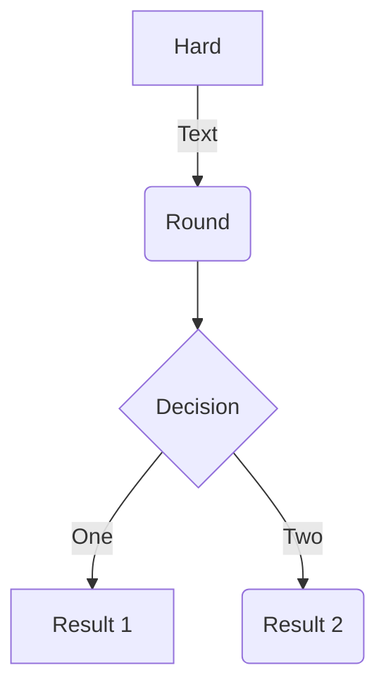
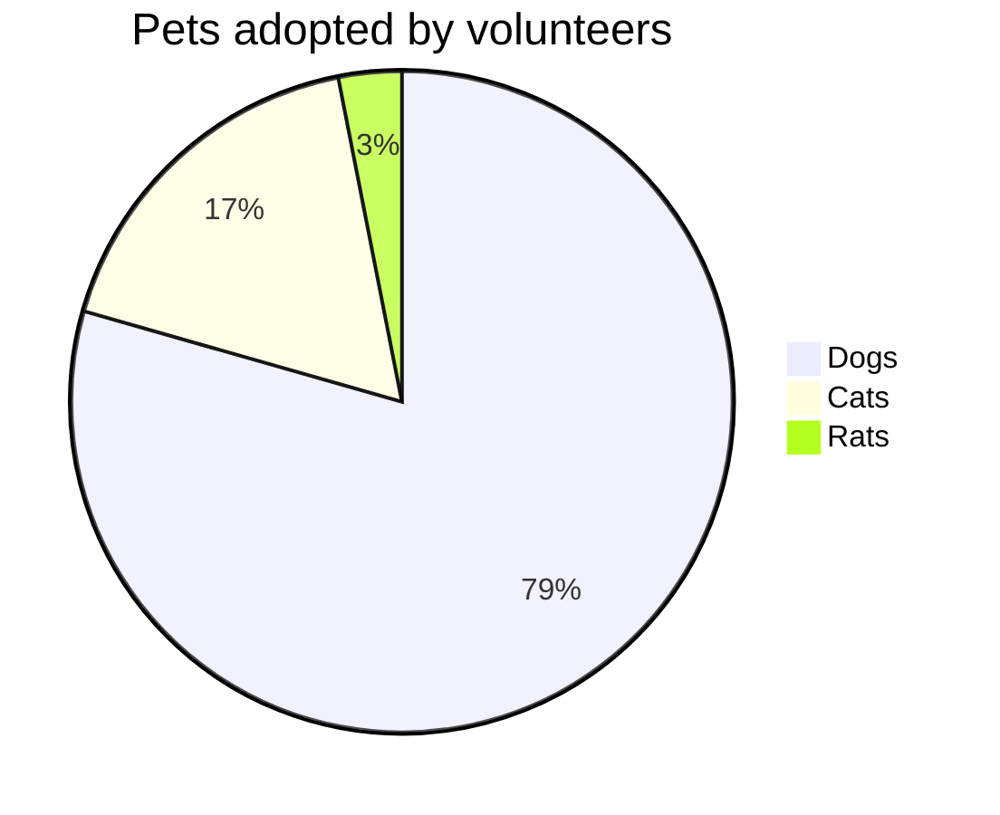

mermaid 流程图 + 饼图使用

# img

## table

| 左对齐 | 右对齐 | 居中对齐 |
| :----- | -----: | :------: |
| 单元格 | 单元格 |  单元格  |
| 单元格 | 单元格 |  单元格  |

## 流程图

## 饼图

> https://mermaid-js.github.io/mermaid/#/pie

## 参考

1. [mermaid](https://github.com/mermaid-js/mermaid/blob/develop/README.zh-CN.md)
